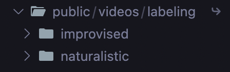

# Simple Two-Videos Side-by-Side (React + Vite)

A minimal React + Vite app to view two videos side-by-side and inspect associated prompts.

This README is a short, practical guide to get you running and to make external video files available to the app.

---

## Quick summary

- Shows two videos for each conversation and displays prompts for each participant.
- Navigation: Previous / Next conversation.
- Playback: a single Play/Pause button attempts to play both videos in sync and there are Back/Forward 10s seek buttons.
- The app remembers the last-opened conversation (saved by conversation id in localStorage).

---

## Prerequisites (macOS / zsh)

- Node.js (recommended >= 20.19)
- npm

Check versions:

```zsh
node -v
npm -v
```

If you need to upgrade Node, use nvm or Homebrew:

```zsh
# install nvm if you don't have it
curl -fsSL https://raw.githubusercontent.com/nvm-sh/nvm/v0.39.5/install.sh | bash
# install + use a supported Node version
nvm install 20.19.0
nvm use 20.19.0
```

---

## Serving videos that live outside the project (recommended options)

Browsers that load your app over HTTP won't play arbitrary `file://` URLs. Use one of these approaches to make external videos available:

1. Symlink into `public/` (quick)

```zsh
# create a symlink inside the project's public/ so Vite serves the files
ln -s /path/to/datasets ./public/videos
# then reference videos as: /datasets/.../video.mp4
```

Notes: Some OS/browser combos may block symlinked content. If playback fails, try option 2.

2. Rename the folder to **labeling** so the path to the files is `/public/videos/labeling`

## Public folder should look like this



---

## Quick start

From the project root:

```zsh
npm install
npm run dev
```

Open the URL printed by Vite (usually http://localhost:5173).

---

## What to do if the dev server complains

- Error: "Vite requires Node.js version 20.19+ or 22.12+" — upgrade Node (see Prerequisites).
- Error: "Cannot find module '@vitejs/plugin-react'" — run:

```zsh
npm install -D @vitejs/plugin-react
```

Then re-run `npm install` and `npm run dev`.

---

## Data the app uses

- The viewer reads `assets/videos_grouped.json` which should contain an array of `conversations`.
- Each conversation typically has an `id`, a `videos` array (each with a `file_path`), and a `prompts` object with participant prompt text.

If your JSON structure differs, update the viewer component (`src/ConversationViewerClean.jsx`) accordingly.

---
